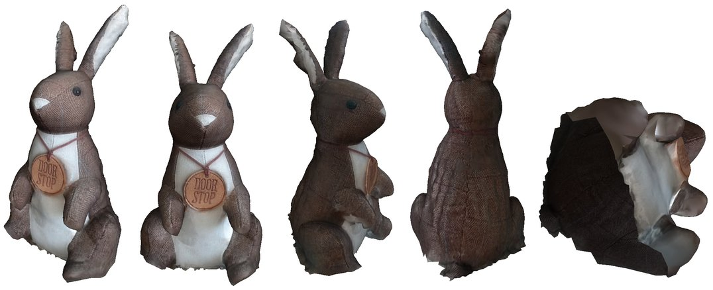

# Door rabbit model

## Preview

## Stats

|            | Original mesh | Reduced mesh |
|------------|---------------|--------------|
| Faces      | 23386         | 4000         |
| Vertices   | 13963         | 4270         |
| Texture    | 2048x2048     | 1024x1024    |

## Files

The size of models in tables is mesh-only size, i.e. **without** textures and accompanying files (e.g. material files). If a direct download link is available, the size contains everything (mesh, texture, accompanying files).

> The only exception is the [Nexus](http://vcg.isti.cnr.it/nexus/) multi-resolution format, where the size always contains everything, since the format packs everything into a single binary file (or multiple binary files for the "deepzoom" variant).

If not specified otherwise, all meshes contain vertices, texture coordinates and normals.

### Original mesh

| File                                | Notes                                  | Size     | Download |
|-------------------------------------|----------------------------------------|----------|----------|
| door_rabbit.obj                     |                                        |  2230 KB | [zip (1144 KB)](/../../raw/main/models/door_rabbit/original/obj/door_rabbit-original-obj.zip)
| door_rabbit.nxs                     | [Nexus](http://vcg.isti.cnr.it/nexus/) |  1765 KB | [nxs (1765 KB)](/../../raw/main/models/door_rabbit/original/nxs/door_rabbit.nxs)
| door_rabbit.nxs                     | deepzoom Nexus                         |  1765 KB | [zip (1537 KB)](/../../raw/main/models/door_rabbit/original/nxs-deepzoom/door_rabbit-original-nxs-deepzoom.zip)

### Reduced mesh

| File                                | Notes                                  | Size     | Download |
|-------------------------------------|----------------------------------------|----------|----------|
| door_rabbit.obj                     |                                        |   526 KB | [zip (271 KB)](/../../raw/main/models/door_rabbit/reduced/obj/door_rabbit-reduced-obj.zip)
| door_rabbit-no-normals.obj          | only vertices and textures             |   336 KB |
| door_rabbit-no-texture-coords.obj   | only vertices and normals              |   401 KB |
| door_rabbit-only-vertices.obj       | only vertices                          |   199 KB |
| door_rabbit.ply                     | ASCII PLY                              |   524 KB | [zip (262 KB)](/../../raw/main/models/door_rabbit/reduced/ply/door_rabbit-reduced-ply.zip)
| door_rabbit-binary.ply              | binary PLY                             |   265 KB | [zip (253 KB)](/../../raw/main/models/door_rabbit/reduced/ply/door_rabbit-reduced-ply-binary.zip)
| door_rabbit.nxs                     | [Nexus](http://vcg.isti.cnr.it/nexus/) |   267 KB | [nxs (267 KB)](/../../raw/main/models/door_rabbit/reduced/nxs/door_rabbit.nxs)
| door_rabbit.nxs                     | deepzoom Nexus                         |   267 KB | [zip (218 KB)](/../../raw/main/models/door_rabbit/reduced/nxs-deepzoom/door_rabbit-reduced-nxs-deepzoom.zip)

## Notes

The mesh has some geometric deformations and isn't closed (the rabbit doesn't have a butt). Also, one side of the mesh is darker than the other one.

## About the model

The model is actually a door stop I have once bought in a mall. Considering the fact it was captured by a phone (using the free 3D Creator mobile app from Sony) and after only few minutes of effort, the result isn't that bad. Since the rabbit sat on the table during the capture, its butt couldn't have been scanned very well, so I decided to remove it completely from the mesh.

## License

You can do whatever you want with the model.
